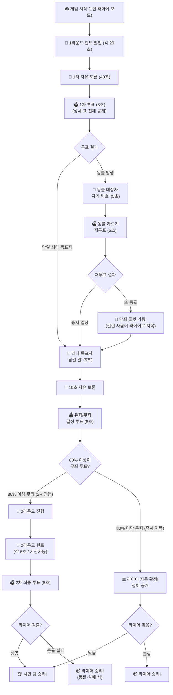
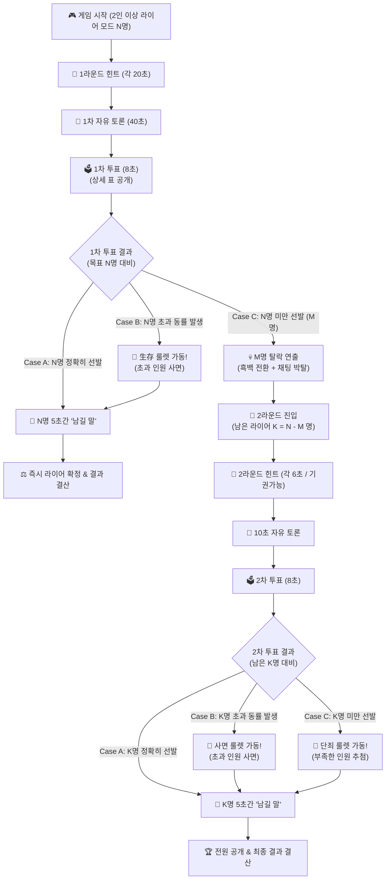

# [최종 기획서 v6] 라이어 게임 1인 모드 & 2인 이상 모드 전체 진행 스펙

본 문서는 1인 라이어 모드의 룰렛 적용 코멘트("1인 모드 룰렛에 걸린 사람이 라이어로 지목")까지 완벽히 반영된 최종 v6 공식 기획서입니다.

---

## 🎯 1인 라이어 모드 핵심 룰 (Liar = 1명)

1. **1라운드 힌트 발언 (각 20초):** 순서대로 발언. 자기 턴에만 대화 가능 (`[발언 완료 ➔]` 버튼으로 넘기기 가능).
2. **1차 자유 토론 (40초) & 1차 투표 (8초):** 전체 공개 상세 표 팝업.
3. **1차 투표 결과 분기:**
   * **[단일 최다 득표 시]:** 최다 득표자 5초간 **"남길 말"** ➔ 10초 자유 토론 ➔ **"80% 무죄 결정 투표 (8초)"**
     * **80% 이상 무죄 투표 시:** **2라운드 진입!** (힌트 각 6초, 기권 가능)
     * **80% 미만 무죄 투표 시:** **즉시 라이어 지목 확정 & 정체 공개!**
   * **[동률 발생 시]:** 동률 대상자 5초간 **"자기 변호"** ➔ 재투표(5초). 
     * 재투표에서도 또 동률 시 **`🎰 단죄 룰렛`** 가동 ➔ **룰렛에 걸린 사람이 라이어 후보로 즉시 지목!**

---

## 🎯 2인 이상 라이어 모드 핵심 룰 (Liar N명)

1. **1라운드 힌트 발언 (각 20초) ➔ 자유 토론 (40초) ➔ 1차 투표 (8초)**
2. **1차 투표 결과 분기:**
   * **Case A (N명 정확히 선발):** 5초간 남길 말 ➔ **즉시 라이어 결정 확정 & 결과 결산!**
   * **Case B (N명 초과 동률):** **`🎰 生存(생존) 룰렛`** 가동 (1명 사면) ➔ 남은 N명 남길 말 ➔ **라이어 확정!**
   * **Case C (N명 미만 M명 선발):** M명 **흑백 전환 + 채팅 박탈 (탈락)** ➔ 남은 수(K = N - M 명) 들고 **2라운드 진입!**
3. **2라운드 (남은 수 K명) 투표 결과 분기:**
   * **Case A (K명 정확히 선발):** 남길 말 ➔ **라이어 확정 & 결과 결산!**
   * **Case B (K명 초과 동률):** **`🎰 사면 룰렛`** 가동 (초과자 사면) ➔ K명 라이어 확정!
   * **Case C (K명 미만 선발):** **`🎰 단죄 룰렛`** 가동 (부족한 인원 무작위 지정) ➔ K명 채우고 최종 결산!

---

## 🗺️ 1. [1인 라이어 모드] 최종 다이어그램

---

## 🗺️ 2. [2인 이상 라이어 모드] 최종 다이어그램

