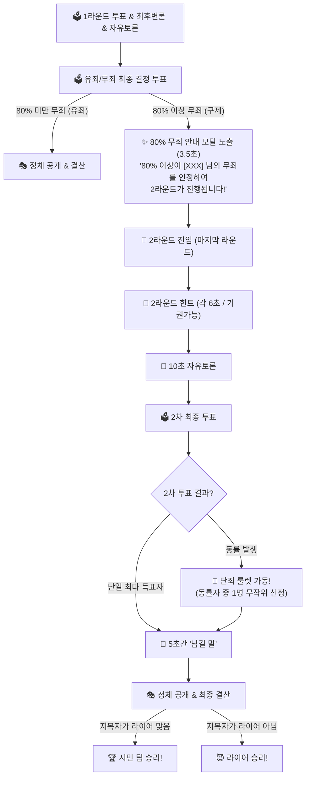

# 📋 [기획서 v1.2] 2라운드 1회 제한 & 80% 무죄 구제 모달 & 2라운드 동률 룰렛 스펙

> **작성일:** 2026-07-29  
> **관련 문서:** [PLAY_PLAN.md](file:///d:/Make_Game/Liar_Game/.agents/docs/PLAY_PLAN.md), [2026-07-29_투표후_최후변론_플로우_SPEC.md](file:///d:/Make_Game/Liar_Game/.agents/docs/2026-07-29_투표후_최후변론_플로우_SPEC.md)  
> **상태:** 🟡 사용자 검토 및 승인 대기

---

## 📌 개요

1. **2라운드 1회 제한**: 게임은 **최대 2라운드까지만** 진행되며, 2라운드가 끝나면 반드시 결과가 공개되고 게임이 종료된다 (무한 루프 방지).
2. **80% 무죄 구제 안내 모달 (가독 시간 3.5초)**: 1라운드 최종 결정에서 80% 이상 무죄 판정 시, 사용자가 충분히 상황을 인지할 수 있도록 명확한 안내 모달을 3.5초간 노출한 후 2라운드로 진입한다.
3. **2라운드 동률 룰렛 & 최종 승패 결정**: 2라운드 투표에서 동률이 발생할 경우 재투표 없이 **즉시 `🎰 단죄 룰렛`**을 돌려 1명을 최종 선발하고, 5초간 '남길 말'을 들은 뒤 라이어 여부에 따라 승패를 결산한다.

---

## 🎯 상세 진행 스펙

### 1️⃣ 80% 무죄 구제 안내 모달 연출 (1라운드 ➔ 2라운드 전환 시)
- **발동 조건**: 1라운드 최종 결정 투표에서 **80% 이상이 무죄**를 선택했을 때
- **모달 디자인 및 문구**:
  - **헤더**: `✨ INNOCENT CLEARED (80% 무죄 판정)`
  - **주 문구**: `"80% 이상이 [XXX] 님의 무죄를 인정하여 2라운드가 진행됩니다!"`
  - **서브 문구**: `잠시 후 2라운드 힌트 발표(각 6초)가 시작됩니다.`
- **노출 시간**: **3.5초간 명확하게 노출** (충분한 가독성 보장) 후 2라운드 힌트 발언 단계로 진입.

---

### 2️⃣ 2라운드 진행 룰 (1회 제한)

```
[2라운드 시작] ➔ 힌트 발표 (각 6초, 기권 가능) ➔ 10초 자유 토론 ➔ 2차 최종 투표
```

#### 2차 최종 투표 결과 분기:

1. **Case A: 단일 최다 득표자 선발 시**
   - 최다 득표자가 **5초간 '남길 말'** 발표
   - 바로 정체 공개 및 최종 승패 결산!

2. **Case B: 동률 발생 시**
   - **재투표 진행하지 않음!**
   - **`🎰 단죄 룰렛`** 즉시 가동 (동률 대상자들 중 1명 무작위 추첨)
   - 룰렛에 걸린 인원이 **5초간 '남길 말'** 발표
   - 바로 정체 공개 및 최종 승패 결산!

---

### 3️⃣ 최종 승패 결산 규칙 (2라운드 종료 시)

- 지목된 최다 득표자(또는 룰렛 선택자)의 정체를 공개:
  - 🏆 **지목된 사람이 라이어인 경우**: **시민 팀 승리!** (라이어 패배)
  - 😈 **지목된 사람이 라이어가 아닌 경우**: **라이어 승리!** (시민 팀 패배)

---

## 🗺️ 전체 플로우 다이어그램



---

## 🛠️ 백엔드 / 프론트엔드 변경 포인트 (예상)

1. **백엔드 (`server/index.js`)**:
   - 2라운드 여부(`room.round === 2`) 체크 및 무한 2라운드 재진입 방지
   - 2라운드 투표 결과 수집 시 동률 발생하면 `startPostVoteFlow` 대신 즉시 `triggerReVoteRoulette` ➔ `LastWords` ➔ `revealLiarResult`로 직행
   - 80% 무죄 시 3.5초 타이머 후 2라운드 전환
2. **프론트엔드 (`App.tsx`)**:
   - `✨ 80% 이상이 [XXX] 님의 무죄를 인정하여 2라운드가 진행됩니다!` 안내 모달 UI 추가 (3.5초 표시)
   - 2라운드 결과 모달에서 '남길 말' 5초 연출 후 정체 공개
