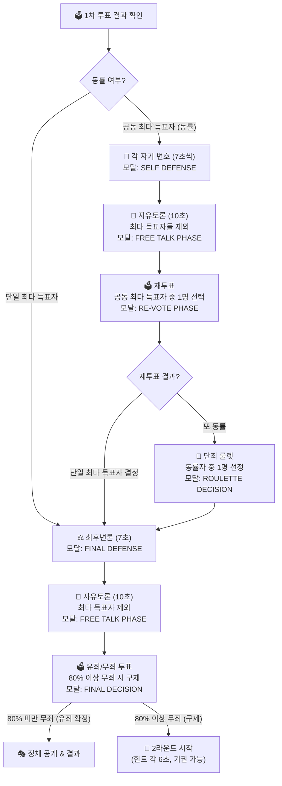

# 📋 [기획서] 투표 후 최후변론 → 자유토론 → 최종 결정 플로우 v1

> **작성일:** 2026-07-29  
> **관련 기존 기획서:** [PLAY_PLAN.md](file:///d:/Make_Game/Liar_Game/.agents/docs/PLAY_PLAN.md)  
> **상태:** 🟢 사용자 피드백 반영 완료 (v1.1)

---

## 📌 개요

투표가 완료된 후, 최다 득표자의 **최후변론** → 나머지 인원의 **자유토론** → **라이어 지목 or 2라운드 진행 선택** 과정을 기획한다.  
모든 단계 전환 사이사이에 **차례 안내 모달**(배경 블러 + 팝업)이 표시된다.

---

## 🔷 CASE 1: 단일 최다 득표자 (1명만 최다 득표)

### 1단계: 최후변론 (7초)
- **차례 안내 모달** 등장: `"⚖️ [최다 득표자 닉네임] 님의 최후변론이 시작됩니다! (7초)"`
- 모달이 닫힌 후, 최다 득표자에게만 **7초간 발언권** 부여
- 나머지 인원은 채팅 입력 잠금 (관전 모드)
- 7초 경과 시 자동으로 다음 단계로 전환

### 2단계: 자유토론 (10초)
- **차례 안내 모달** 등장: `"💬 자유토론 시작! (10초) 최다 득표자를 제외한 모든 인원이 대화할 수 있습니다."`
- 모달이 닫힌 후, **최다 득표자를 제외한** 모든 플레이어에게 **10초간 채팅 해금**
- 최다 득표자는 채팅 입력 잠금 (관전 모드)

### 3단계: 최종 결정 투표 (유죄/무죄)
- **차례 안내 모달** 등장: `"🗳️ 최종 결정! [최다 득표자 닉네임]은 라이어인가요?"`
- 선택지 2가지:
  - **🚨 유죄 (라이어로 지목)** → 라이어 정체 공개 및 결과 화면으로 이행
  - **✅ 무죄 (2라운드 진행)** → 2라운드 힌트 발언 (각 6초, 기권 가능) 시작
- 투표 방식: 최다 득표자를 제외한 전원이 `유죄` 또는 `무죄` 중 하나를 선택
- **80% 이상이 무죄 투표 시에만** 2라운드로 진행 (구제)
- **80% 미만 무죄(= 20% 초과 유죄)** → 즉시 라이어 지목 확정 & 정체 공개!

---

## 🔶 CASE 2: 공동 최다 득표자 (동률 발생)

### 1단계: 자기 변호 (각 7초)
- 각 공동 최다 득표자마다 순서대로:
  - **차례 안내 모달** 등장: `"🎤 [닉네임] 님의 자기 변호가 시작됩니다! (7초)"`
  - 모달이 닫힌 후, 해당 플레이어에게만 **7초간 발언권** 부여
  - 나머지 전원은 채팅 잠금
  - 7초 경과 시 다음 공동 최다 득표자의 자기 변호로 넘어감

### 2단계: 자유토론 (10초)
- **차례 안내 모달** 등장: `"💬 자유토론 시작! (10초) 최다 득표자들을 제외한 나머지 인원이 대화할 수 있습니다."`
- 모달이 닫힌 후, **공동 최다 득표자들을 제외한** 나머지 인원에게 **10초간 채팅 해금**
- 공동 최다 득표자들은 채팅 잠금

### 3단계: 재투표 (동률 해소용)
- **차례 안내 모달** 등장: `"🗳️ 재투표! 공동 최다 득표자 중 1명을 선택해 주세요."`
- 공동 최다 득표자들을 제외한 나머지 인원이 **공동 최다 득표자들 중 1명**을 선택하여 투표
- 투표 결과에 따라 분기:

#### 3-A: 재투표에서 단일 최다 득표자가 나온 경우
→ **CASE 1의 1단계(최후변론 7초)** → **2단계(자유토론 10초)** → **3단계(최종 결정 투표)** 순서대로 진행

#### 3-B: 재투표에서도 다시 동률이 발생한 경우
- **차례 안내 모달** 등장: `"🎰 단죄 룰렛 가동! 동률을 해소합니다."`
- **룰렛 연출**로 동률자 중 1명을 무작위 선정하여 최다 득표자로 확정
- 이후 → **CASE 1의 1단계(최후변론 7초)** → **2단계(자유토론 10초)** → **3단계(최종 결정 투표: 80% 무죄 기준)** 순서대로 진행

---

## 🎨 차례 안내 모달 디자인

기존에 구현된 **힌트 발언 차례 모달**(speakerTurnNotice)과 **자유토론 안내 모달**(showFreeTalkNotice)의 디자인을 그대로 활용한다.

| 항목 | 스펙 |
|------|------|
| **배경** | `backdrop-filter: blur(12px)`, `background: rgba(0,0,0,0.65)` |
| **모달 카드** | `.nickname-modal` 스타일 기반, 테두리 색상은 단계별로 변경 |
| **표시 시간** | 약 2초 후 자동 닫힘 (기존 1.8~2.5초 패턴 준용) |
| **애니메이션** | `popIn 0.3s ease` (기존 애니메이션 재사용) |

### 단계별 모달 테두리/라벨 색상
| 단계 | 라벨 | 테두리 색상 |
|------|------|-------------|
| 최후변론 | `FINAL DEFENSE` | `#ff4785` (핑크) |
| 자기 변호 | `SELF DEFENSE` | `#f5b300` (골드) |
| 자유토론 | `FREE TALK PHASE` | `#635bff` (보라) |
| 최종 결정 | `FINAL DECISION` | `#10b981` (그린) |
| 재투표 | `RE-VOTE PHASE` | `#ff6f3c` (오렌지) |
| 단죄 룰렛 | `ROULETTE DECISION` | `#ff4785` (핑크) |

---

## 📊 전체 플로우 다이어그램

---

## 🛠️ 구현 영향 범위 (예상)

### 프론트엔드 (`App.tsx`)
- **새로운 gamePhase 값 추가:** `"final-defense"`, `"self-defense"`, `"post-vote-free-talk"`, `"final-decision"`, `"re-vote"`
- **새로운 State 추가:** 최다 득표자/공동 최다 득표자 소켓 ID 배열, 최종 결정 투표 결과 등
- **새로운 모달 UI 5종:** 최후변론 모달, 자기 변호 모달, 투표 후 자유토론 모달, 최종 결정 모달, 재투표 모달
- **채팅 제어 로직 확장:** 각 단계별 발언 가능/불가능 플레이어 분기

### 백엔드 (`server/index.js`)
- **투표 결과 분석 로직 추가:** 동률 판별, 최다 득표자 추출
- **새로운 소켓 이벤트:** `final-defense-start`, `self-defense-start`, `post-vote-free-talk`, `final-decision-vote`, `re-vote`
- **단계별 타이머 관리:** 6초/7초/10초 자동 전환 타이머

---

## ✅ 확정 사항 (사용자 피드백 반영 완료)

1. **최종 결정 투표 기준**: ✅ 80% 이상이 무죄 투표 시에만 2라운드 진행 (구제). 그 외에는 즉시 라이어 지목 확정.
2. **시간 설정**: ✅ 최후변론 **7초** / 자기 변호 **7초** / 자유토론 **10초**
3. **2라운드**: ✅ 기존 v6 룰 적용 (힌트 각 6초, 기권 가능)
