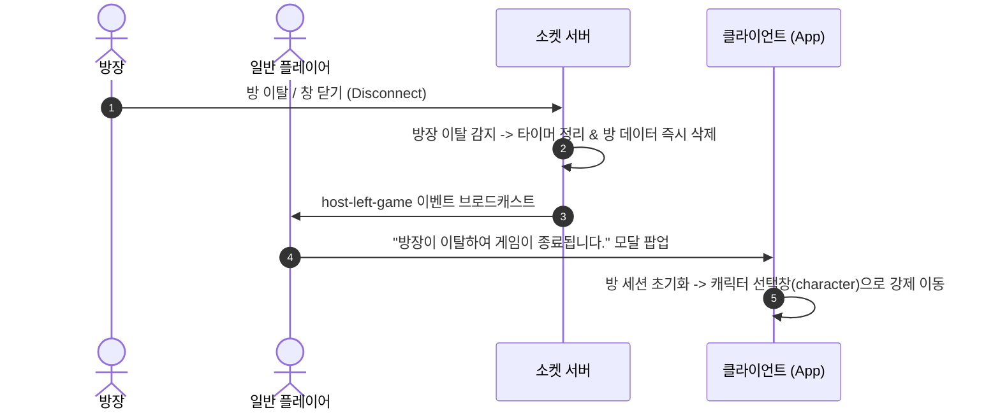

# [기획서] 게임 중 플레이어 및 방장 이탈 처리 규칙 명세 (SPEC)

## 1. 개요 및 배경
라이어 게임 진행 중 플레이어가 네트워크 끊김, 브라우저 종료, 뒤로가기 등으로 방을 이탈했을 때의 예외 처리와 플로우를 명확히 정의합니다.
기존 시스템에서 발생하던 다음 문제점들을 완벽히 해결합니다.
1. 게임 중 플레이어 이탈 시 남은 인원 체크 기준 미흡 (기존: 2명 미만 ➔ 변경: **2명 이하**일 때 대기실 복귀)
2. 방장 이탈 시 방 승계로 인해 게임이 어색하게 유지되던 문제 (➔ 변경: **방장 이탈 시 방 폭파 및 '캐릭터 선택창' 강제 퇴장**)
3. 투표 중 플레이어 이탈 시 투표 집계가 멈추거나 이탈 알림 모달이 뜨지 않던 현상
4. 재접속 대기로 인한 게임 딜레이 (➔ 변경: **이탈 즉시 영구 제외 및 기다림 없이 즉시 진행**)

---

## 2. 핵심 정책 및 플로우

### 2-1. 재접속 및 이탈자 처리 정책 (즉시 제외 & 영구 퇴장)
- **기존 방식**: 이탈자를 `isDisconnected: true` 상태로 두고 일정 시간 재접속 대기
- **개선 방식**: 
  - 플레이어가 접속 종료(Disconnect) 또는 퇴장(Leave) 시 **즉시 방에서 영구 제거**합니다.
  - 대기 시간 없이 즉시 턴/투표/후보 목록에서 제외하고 남아있는 인원으로 즉시 게임을 이어나갑니다.
  - 이미 게임 중인 방에는 동일 닉네임이라도 재입장할 수 없습니다. ("이미 게임이 진행 중인 방입니다.")

---

### 2-2. 방장 이탈 시 처리 정책 (방 폭파 & 캐릭터 선택창 이동)
- **발생 조건**: 방장(`isHost === true`)이 대기실 또는 게임 진행 중 퇴장/접속 종료한 경우
- **동작 방식**:
  1. 서버는 해당 방의 모든 타이머를 제거하고 방 데이터를 완전히 삭제(폭파)합니다.
  2. 서버는 남아있는 모든 플레이어에게 `host-left-game` 이벤트를 송신합니다.
  3. 클라이언트는 화면에 **"방장이 이탈하여 게임이 종료됩니다."** 전면 시스템 알림 모달을 띄웁니다.
  4. 알림 모달 확인(또는 2.5~3초 후 자동) 시 방 세션을 완전히 초기화(`roomCode = null`, `onlinePlayers = []` 등)하고 **캐릭터 선택창(`screen = 'character'`)**으로 강제 이동합니다.
  5. 방이 삭제되었으므로 대기실로 이동하는 버튼이나 복귀 루트는 완전히 차단됩니다.

---

### 2-3. 일반 플레이어 이탈 시 분기 처리 (2명 이하 vs 3명 이상)

#### CASE A: 이탈 후 남은 인원이 **2명 이하 (<= 2명)** 인 경우
- 라이어 게임은 최소 3인 이상(방장 1 + 플레이어 2)이어야 정상 진행이 가능합니다.
- 따라서 남은 인원이 2명 이하가 되면 **현재 게임을 즉시 중단**하고 대기실로 복귀합니다.
- **동작 방식**:
  1. 서버는 진행 중인 모든 게임 타이머(턴 타이머, 투표 타이머 등)를 중단합니다.
  2. 방 상태를 대기실 모드(`room.gameState = 'waiting'`, `room.phase = 'waiting'`)로 전환합니다.
  3. 모든 참가자에게 `not-enough-players` 이벤트를 브로드캐스트합니다.
     - 메시지: `"인원이 2명 이하로 줄어들어 게임이 종료되어 대기실로 이동합니다."`
  4. 클라이언트는 안내 모달을 띄운 뒤 확인 후 **대기실(`screen = 'room'`)**로 이동합니다.

#### CASE B: 이탈 후에도 남은 인원이 **3명 이상 (>= 3명)** 인 경우
- 게임을 중단하지 않고 즉시 이탈자를 제외한 채 계속 진행합니다.
- 모든 참가자에게 `player-left` 이벤트를 전송하여 화면에 `"📢 [플레이어명] 님이 퇴장하였습니다."` 알림 토스트/모달을 띄웁니다.
- **진행 중인 페이즈별 즉각 보정 로직**:
  1. **힌트 발언 턴 (`hint-turn`)**:
     - 이탈자가 현재 발언자(`turnSpeakerSocketId`)였던 경우: 즉시 다음 플레이어로 턴 넘김 (`turn-changed`).
     - `turnCount` 및 전체 인원 수를 재계산하여 전원 발언 완료 조건(`turnCount >= remainingPlayers.length`) 시 즉시 자유 토론으로 전환.
  2. **투표 단계 (`vote`, `re-vote`, `final-decision`)**:
     - 이탈자의 기투표 데이터 제거.
     - 나간 플레이어를 지목했던 투표 무효화 또는 재조정.
     - 남은 인원 기준으로 실시간 투표 진행 현황(`vote-progress`) 재계산 전송.
     - 남은 인원이 모두 투표를 마쳤다면 대기 없이 즉시 개표/집계 실행.
  3. **최후변론 / 자기변호 (`final-defense`, `self-defense`)**:
     - 변호 중이던 유저가 나간 경우: 즉시 다음 순번의 자기변호 또는 자유토론 단계로 스킵.
  4. **라이어 이탈 시**:
     - 바보 라이어 모드 / 클래식 모드에서 라이어로 선출된 플레이어가 나간 경우:
       - 남은 라이어가 0명이 되면 라이어 팀 패배/시민 승리로 즉시 결과 처리하거나 대기실 복귀 안내.

---

## 3. 세부 화면 및 UI/UX 인터랙션 설계

### 3-1. 이탈 알림 UI
1. **방장 이탈 알림 모달**:
   - 타이틀: 🚨 게임 종료 안내
   - 본문: `"방장이 방을 이탈하여 게임이 완전히 종료되었습니다.\n캐릭터 선택 화면으로 이동합니다."`
   - 버튼: `[확인]` (클릭 시 즉시 이동, 3초 미입력 시 자동 이동)
   - 이동 대상: **캐릭터 선택 화면 (`screen = 'character'`)**

2. **인원 부족 (2명 이하) 알림 모달**:
   - 타이틀: ⚠️ 인원 부족 게임 종료
   - 본문: `"남은 인원이 2명 이하가 되어 더 이상 게임을 진행할 수 없습니다.\n대기실로 이동합니다."`
   - 버튼: `[대기실로 이동]` (클릭 시 즉시 이동, 2.5초 후 자동 이동)
   - 이동 대상: **대기실 화면 (`screen = 'room'`)**

3. **투표 중/게임 중 일반 플레이어 이탈 토스트/배너**:
   - 위치: 상단 또는 중앙 플로팅 배너
   - 내용: `"📢 [🦊 닉네임] 님이 방을 나갔습니다. (남은 인원: N명)"`
   - 효과: 투표 화면이나 플레이 화면을 가리지 않으면서도 명확히 인지되도록 2초간 표시 후 페이드아웃.

---

## 4. 백엔드 및 프론트엔드 연동 명세

### 4-1. Socket 이벤트 명세
| 이벤트명 | 방향 | 파라미터 | 설명 |
| :--- | :--- | :--- | :--- |
| `player-left` | Server ➔ Client | `{ leftPlayerName, leftPlayerIcon, remainingCount }` | 일반 플레이어 이탈 시 방 전체 알림 |
| `host-left-game` | Server ➔ Client | `{ message }` | 방장 이탈로 인한 방 폭파 및 캐릭터 선택창 이동 |
| `not-enough-players` | Server ➔ Client | `{ message, remainingPlayers }` | 2명 이하로 인원 부족 시 대기실 이동 |
| `vote-progress` | Server ➔ Client | `{ votedCount, totalCount }` | 이탈자 발생 시 실시간 투표 카운트 즉시 갱신 |
| `turn-changed` | Server ➔ Client | `{ turnIndex, activeSpeakerSocketId, ... }` | 발언자 이탈 시 즉각 턴 전환 |

---

## 5. 검증 시나리오
1. **방장 이탈 테스트**:
   - 4인 게임 중 방장이 브라우저 탭을 닫거나 뒤로가기 실행.
   - 남은 3명에게 "방장이 이탈하여 게임이 종료됩니다." 모달 노출 확인.
   - 모달 확인 후 캐릭터 선택창으로 정상 이동하는지 확인 (대기실 진입 불가 확인).
2. **2명 이하 인원 부족 테스트**:
   - 3인 게임 중 일반 플레이어 1명이 이탈하여 2명이 남은 경우.
   - 게임이 즉시 멈추고 "인원이 2명 이하로 줄어들어 대기실로 이동합니다." 모달 노출 확인.
   - 방장과 남은 플레이어가 모두 대기실(`screen = 'room'`)로 복귀하는지 확인.
3. **투표 중 플레이어 이탈 테스트**:
   - 4인 게임 투표 화면에서 플레이어 1명 이탈 시 "XXX님이 나갔습니다" 알림 노출 확인.
   - 남은 3명이 모두 투표를 완료했을 때 멈춤 없이 즉시 개표로 넘어가는지 확인.
4. **재입장 차단 테스트**:
   - 이탈한 플레이어가 게임 진행 중 같은 방 코드로 재입장 시도 시 "이미 게임이 진행 중인 방입니다" 에러와 함께 입장 차단 확인.
